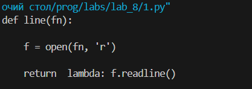
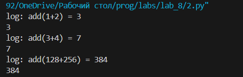

# Лабортная работа №8
## Вариант 3
### Задание
1. Решите обе задачи своего варианта.
2. Примените декоратор к замыканию.
3. Оформите отчёт в README.md. Отчёт должен содержать:
4. Условия задач
5. Описание проделанной работы
6. Скриншоты результатов
7. Ссылки на используемые материалы
### Задание варианта:
1. **Замыкание для получения очередной строки из файла.**
2. **Декоратор, который будет логировать вызовы функций.**

## Код 1
```
def line(fn):
    f = open(fn, 'r')
    return  lambda: f.readline()
f = line('1.py')
print(f())
print(f())
print(f())
```
  

## Код 2
```
def log(f):
    def d(x, y):
        r = f(x, y)
        print(f"log: {f.__name__}({x}+{y}) = {r}")
        return r
    return d

def add(x, y): return x + y

f = log(add)
print(f(1, 2))
print(f(3, 4))
print(f(128, 256))
```
